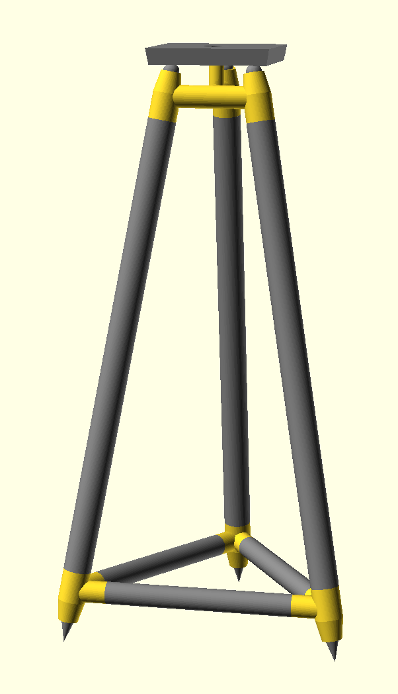
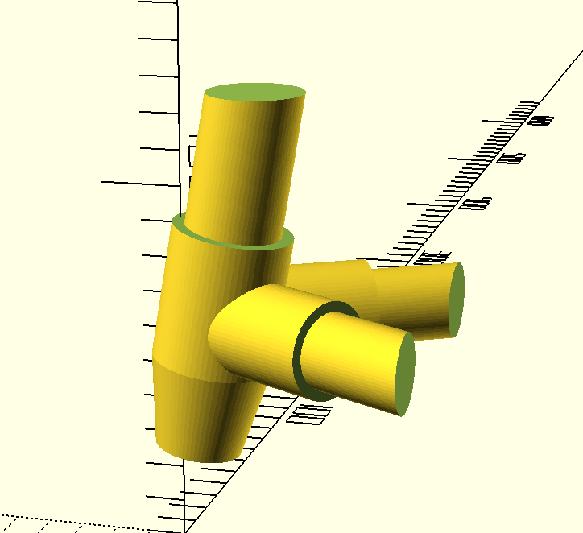
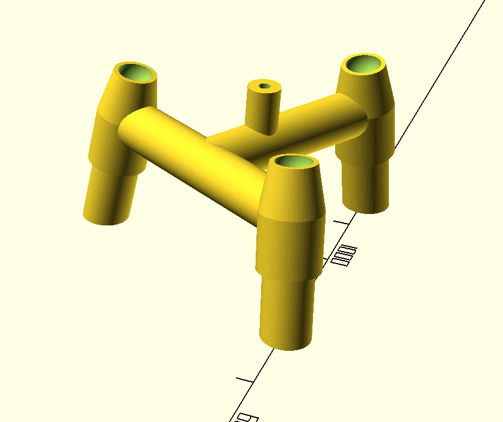
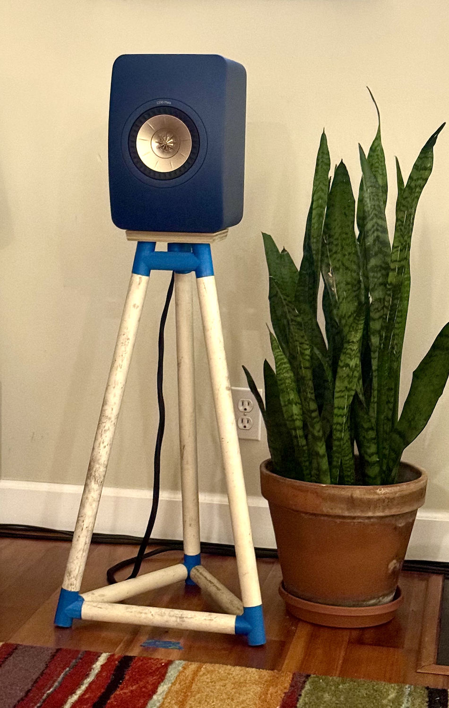

# Tripod Speaker Stand

OpenSCAD file to create tripod speaker stand using PCV pipe and 3D printed parts.

The speaker plate is screwed into the top. Spikes are threaded to hte bottom.

## OpenSCAD File

OpenSCAD file is provided and can be modified to adjust the height and with of the stand, along with many other parameters.

- `stand_height`: Height of the stand, including spikes and top balls. Excludes top itself.
- `top_width`: Width of top square platform
- `top_height`: Height of top platform
- `base_width`: Distance between two legs
- `leg_odiam`: Outside diamater of leg PVC pipe
- `leg_idiam`: Inside diamater of leg PVC pipe
- `truss_odiam`: Outside diamater of truss PVC pipe
- `truss_idiam`: Inside diamater of truss PVC pipe

You can modify the parameters ro create a stand that fits your needs.

**Note:** You will need the BOSL2 library installed to generate the threads. See https://github.com/BelfrySCAD/BOSL2 for installation notes.

## Generating 3D printed parts

You need to set one of the following flags to generate pritable 3D parts.

- `show_part`: set to true if you want to generate one of the parts
- `part`: part to show, values are "hi" and "low"

Parts can be printed on a Prusa Mini printer.

- `show_spike`: show the spikes and the top balls
- `show_top`: show the top plate
- `show_inner`: show the inner diamater PVC pipe

## Materials

- [1" schedule 40 PVC pipe](https://www.amazon.com/gp/product/B085B4SGD1/)
- [3/4" schedule 40 PVC pipe (optional)](https://www.amazon.com/gp/product/B085B4Y5V6/)
- [3/4" steel balls](https://www.amazon.com/gp/product/B07D9SSKN8/)
- [Speaker spikes](https://www.amazon.com/gp/product/B09K3H8FD9/)
- Sand to fill legs
- 1/4"-20 bolt to connect top plate to stand
- 6"x6" plywood top plate
- Epoxy to glue parts

## 3D Printed Parts

Top Part

Bottom Part

## Development

First prototype

