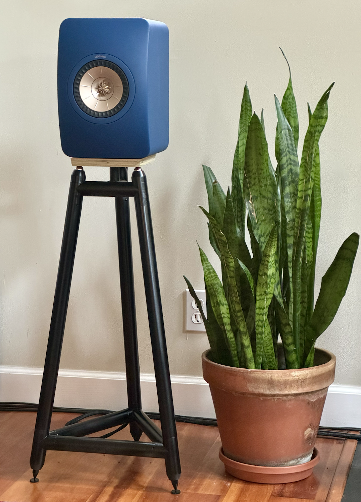
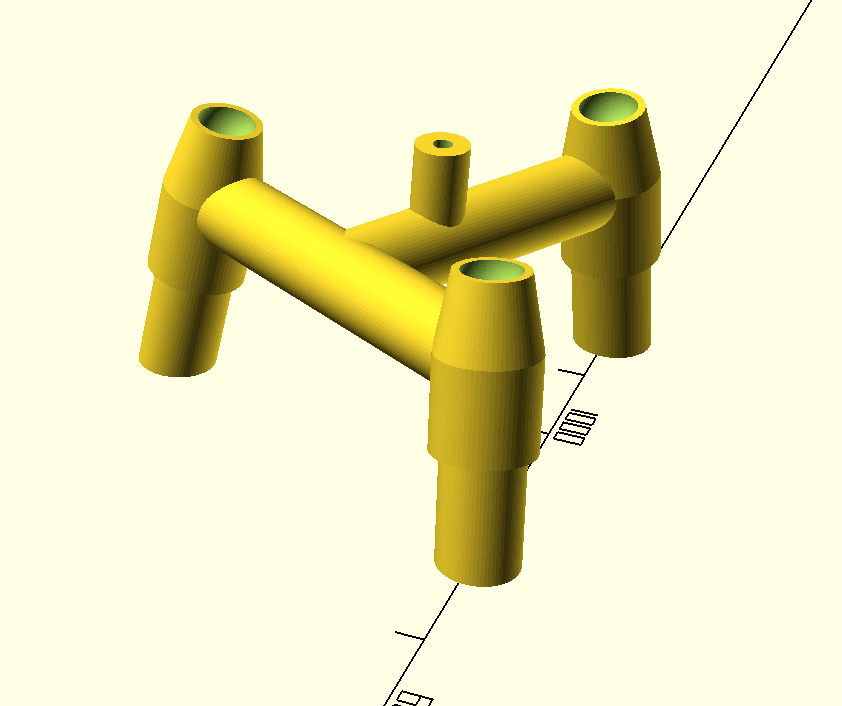
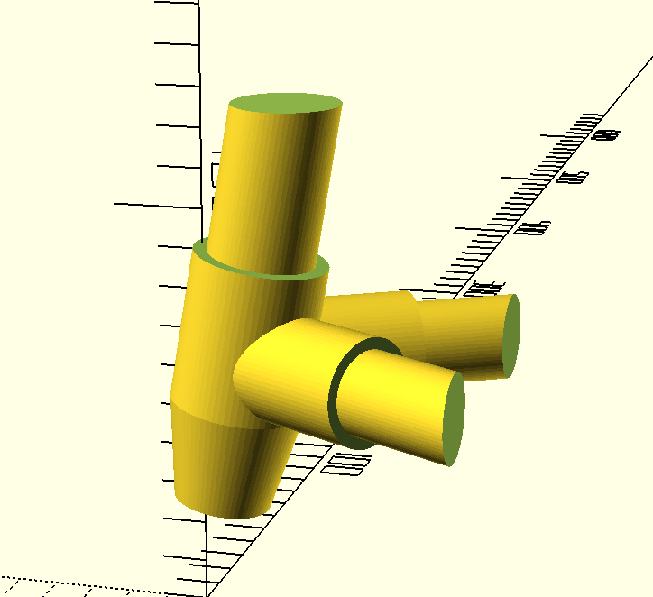
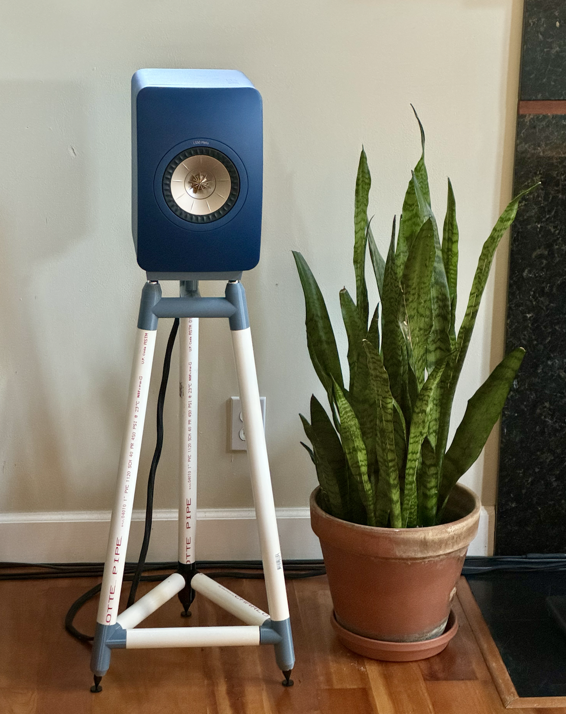

# Tripod Speaker Stand

This is an OpenSCAD file for creating a tripod speaker stand using PVC pipe and 3D printed components.

The top plate for the speaker is attached with a single 1/4"-20 screw. The bottom of the stand features threaded spikes.

## OpenSCAD File

The provided OpenSCAD file allows customization of various stand dimensions and features:

- `default_height`: Total height of the stand, including spikes and top plate.
- `default_width`: Distance between two legs.
- `plate_width`: Width of top plate.
- `plate_height`: Height of top plate.
- `leg_odiam`: Outside diamater of leg PVC pipe.
- `leg_idiam`: Inside diamater of leg PVC pipe.
- `show_part`: Render the part to be printed. Values are `top`, `bottom`, `plate`, `all`, and `hero`.

Adjust these and other parameters to tailor the stand to your requirements.

Additional display options include toggling the visibility of the spikes, top plate, and inner diameter PVC pipe.

**Note:** The BOSL2 library is required for thread generation. Installation details are available at https://github.com/BelfrySCAD/BOSL2

## Generating 3D Printed Parts using SCAD File

I would recommend the following process:

1. Get a sample PVC pipe you will be using and measure the inner and outer diameter of the pipe
1. Check the screw and spike threads types
1. Decide height of the stand
1. Adjust model with all information above
1. Print the test article
1. Print other parts

To create printable 3D parts using the SCAD file:

- `default_show`: part to show, values are "all", "hi", "low", "plate", and "test"

These parts are suitable for printing on a Prusa Mini printer with a 7"x7"x7" bed using the
standard geometry.

## Construction Notes

See the wiki at https://github.com/igfarm/speaker-stand/wiki

## Materials

This is a sample list using vendors in the US.

- 1" schedule 40 PVC pipe for legs and trusses
- Speaker spikes with M6 thread ([Amazon Link](https://www.amazon.com/gp/product/B09K3H8FD9/)) ([AliExpress Link](hhttps://www.aliexpress.us/item/3256804460518547.html))

- 3/4" Steel balls ([Amazon Link](https://www.amazon.com/gp/product/B07D9SSKN8/))
- 1/4"-20 bolt to connect top plate to stand
- Epoxy to glue connectors to tubes
- 3D printed parts
- Sand to fill the legs
- Paint

Please print the test article to make sure the PVC pipe pipe and threads fit. Adjust the source code as needed.

## 3D Printed Parts

I created some examples renders based on standard height and PVC pipe from Home Depot.

- [21" Height](./examples/1-inch-charlotte-pipe/21-inch/)
- [25" Height](./examples/1-inch-charlotte-pipe/25-inch/)
- [29" Height](./examples/1-inch-charlotte-pipe/29-inch/)

### Test Article

This part is used to verify your model settings are correct to fit the pipe and other parts you use. Recommeded to print this before the other parts.

### Top Connector

### Bottom Connector

### Plate (optional)

This is probably done better with MDF or plywoood.

## Development

### Third Prototype

### Second Prototype

Starting to look like the real thing.

- Need to fine tune the gemoetry.
- Print orientation is importat to get proper fitting parts.
- Added a print test article.

### First Prototype

This proof of concept was made using old PVC pipes found in the garage.
