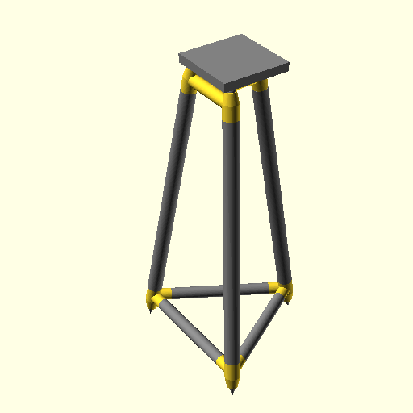

# 28" Tripod Stand

Using 1" and 3/4" PCV pipe for legs and trusses respectively.

## Files

- [Top part STL](./tripod-hi.stl)
- [Bottom part STL](./tripod-hi.stl)
- [Platform STL](./tripod-platform.stl)
- [Tube lengths](./tube_sizes.txt)
- [Complete STL for reference](./tripod.stl)
